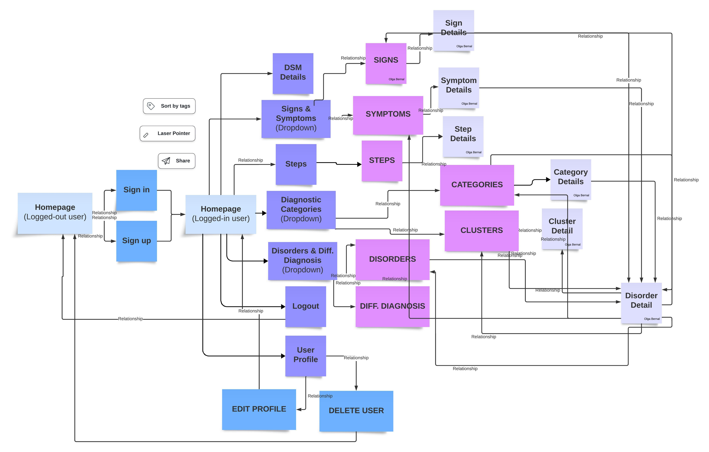

⚠️ This sample repository is currently being developed. 

# 🧠 PsychoDiagnose – Sample Repository

🔒 **Note:** This repository contains **selected code samples** from the full PsychoDiagnose application.  
The full source code is private due to ongoing development and commercialization plans.  
You can explore the complete, fully functional application live at:  
🌐 [**PsychoDiagnose Live**](https://capstone-1-deployment.onrender.com) *(sign up to navigate the app)*
💡***Note*** *: The first load may take a few seconds due to free hosting.*

---

## ℹ️ About PsychoDiagnose

PsychoDiagnose is an **educational web application** that guides psychology and psychiatry students through the structured diagnostic process for mental disorders, based on the **DSM-5-TR** (Diagnostic and Statistical Manual of Mental Disorders, Fifth Edition, Text Revision).

It is designed to:
- Provide an **interactive learning tool** for navigating diagnostic categories, disorders, signs, symptoms, and steps.
- Support **critical thinking** and academic learning without issuing medical diagnoses.
- Offer a **responsive, accessible, and intuitive interface**.

---

## ✨ Motivation

As a psychology student, I often struggled with the complexity of the **DSM** and wished for a tool that made the process easier to understand.  
PsychoDiagnose was built to **simplify learning** for students and professionals, helping them:
- Explore diagnostic criteria step-by-step
- Understand relationships between disorders, signs, and symptoms
- Practice applying structured reasoning in a safe, educational context

---

## 🛠️ Tech Stack

**Backend**
- Python, Flask, Flask Blueprints
- Jinja2 templating engine (server-side rendering)
- SQLAlchemy ORM, PostgreSQL
- Alembic for database migrations
- Flask-WTF, WTForms, Flask-Bcrypt
- Custom REST API for DSM-5-TR content

**Authentication**
- Flask-WTF for form validation and secure user input handling
- Flask-Bcrypt for password hashing to ensure user data security

**Database & Data Handling**
- PostgreSQL for relational data storage (users, categories, clusters, disorders, signs, symptoms, steps, etc.)
- JSON for structured dataset storage
- Custom JavaScript scripts for automated database seeding from JSON files

**API**
- Custom API enabling search and retrieval of diagnostic information programmatically

**File Management**
- Flask-WTF FileField for uploading and handling user profile images

**Frontend**
- Bootstrap 5, HTML5, CSS3
- JavaScript for search functionality, autocomplete dropdowns, and dynamic UI elements

**Testing**
- Python’s built-in `unittest` framework for feature validation and reliability

**Deployment**
- Render (web hosting)
- Supabase (production database)

---

## 📂 What’s Included in This Sample Repo

This repository contains a **curated selection** of the project’s code to illustrate its architecture and implementation style:
- **Sample Flask routes** (backend logic & API design)
- **Representative SQLAlchemy models** with relationships
- **Example WTForms form classes** for validation
- **A Jinja2 template** with conditional rendering
- **Database seeding snippet** showing JSON data integration (with mock/partial data)
- **Example JavaScript script** for automated database seeding (using mock data)

---

## 📌 Key Features (Full Application)

- Secure user authentication (signup, login, password hashing, and profile management)
- Robust form validation for all user input (e.g., password with at least 8 characters, including one uppercase letter, one lowercase letter, one number, and one special character)
- Editable and deletable user profiles with optional profile photo upload (default icon if none provided) 
- Responsive design for optimal use on any device 
- Search functionality with autocomplete and alphabetical sorting for quick navigation  
- Modular REST API architecture with 30+ endpoints for structured content retrieval and cross-referenced navigation
- Multiple hyperlinks within key sections for quick cross-referencing  
- Role-based dynamic views for logged-in and guest users  
- Educationally structured categories, clusters, disorders, signs, symptoms, diagnostic steps, and differential diagnoses, following the DSM-5-TR guidelines as a reference alongside general diagnostic standards
- Guided diagnostic steps with dynamic content rendering and interactive navigation across structured content to support learning in psychopathology

---

## User Flow

---

## 📬 Contact

- **LinkedIn:** [linkedin.com/in/olga-bernal](https://www.linkedin.com/in/olga-bernal)  
- **Email:** your-email@example.com  

